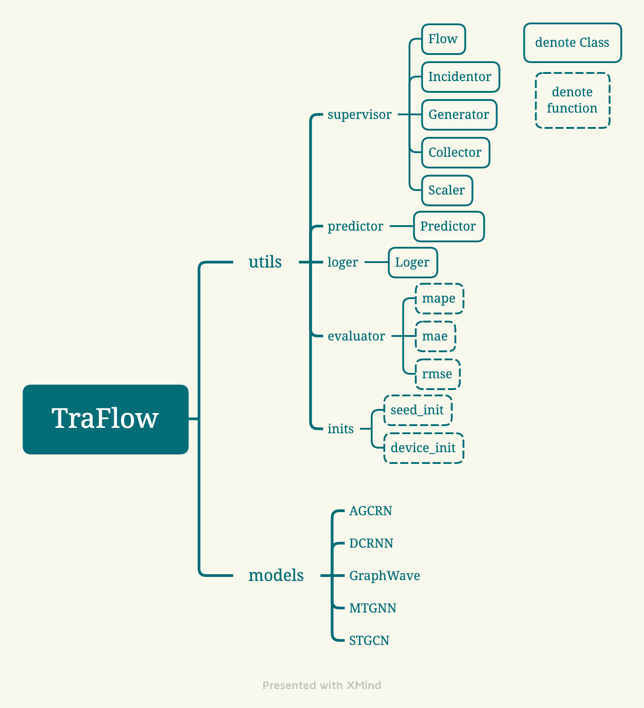

## TraFlow
TraFlow is a benchmark for traffic flow prediction.

### utils file

- `supervisor`
  - Class `Flow` is used to normalize the shape of inputs, as `[batch size, time spans, nodes, features]`.
  - Class `Incidentor` for managing the correlation of nodes over graph.
  - Class `Generator` split train set, valational set and test set.
  - Class `Collector` collect models' outputs.
  - Class `Scaler` normalize traffic flow.
- `predictor`
  - Class `Predictor` for training models over a special dataset, with customized optimizer or loss by user.
- `loger`
  - Class `Loger` to manage some information from training process, evaluation and so on.
- `evaluator` include some metrics, such as `mape`, `mae`, `rmse`.
- `inits ` to initialize seed and device (CPU or GPU).

### models file

This file contains only five models for the time being，i.e., AGCRN, DCRNN, GraphWave, MTGNN, STGCN.
